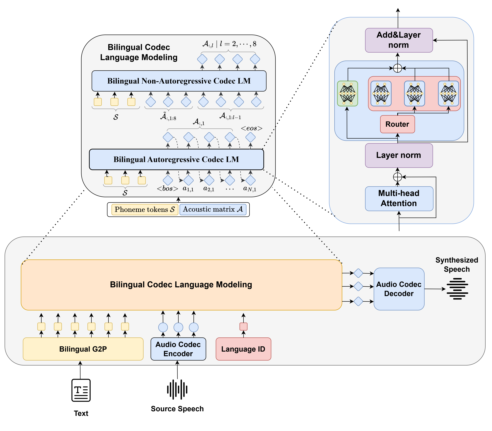

# Vall MoE

## Create a virtual environment
create a conda enviroment 
```
    pip install -r requirements.txt
```

activate the environment
```
    conda activate vall_moe
```

## run
```
  python Basic.py 

```
### Basic.py
```
# generate audio from text
text_prompt = """
text...
"""
audio_array = generate_audio(text_prompt)

# save audio to disk
write_wav("vall_moe.wav", SAMPLE_RATE, audio_array)

# play text in notebook
Audio(audio_array, rate=SAMPLE_RATE)

# Use given transcript
make_prompt(name="paimon", audio_prompt_path="paimon_prompt.wav",
                transcript="Just, what was that? Paimon thought we were gonna get eaten.")

# Alternatively, use whisper
make_prompt(name="paimon", audio_prompt_path="paimon_prompt.wav")

```


